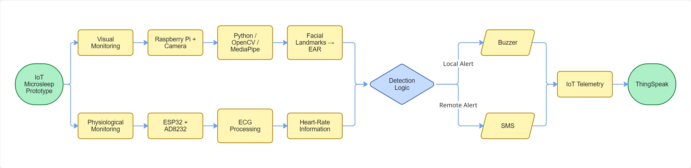
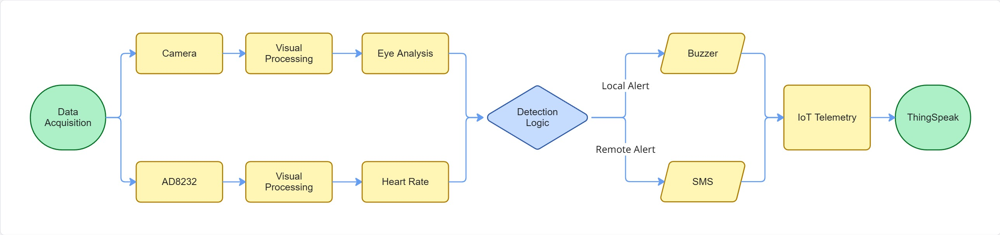
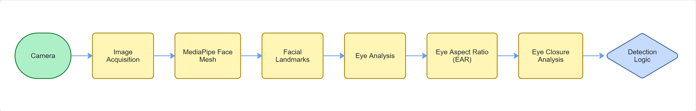
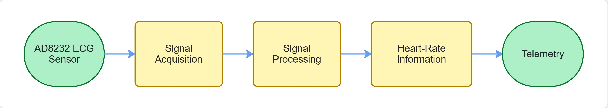
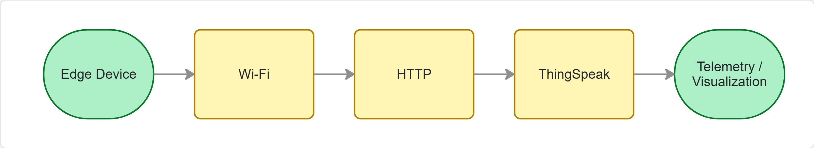
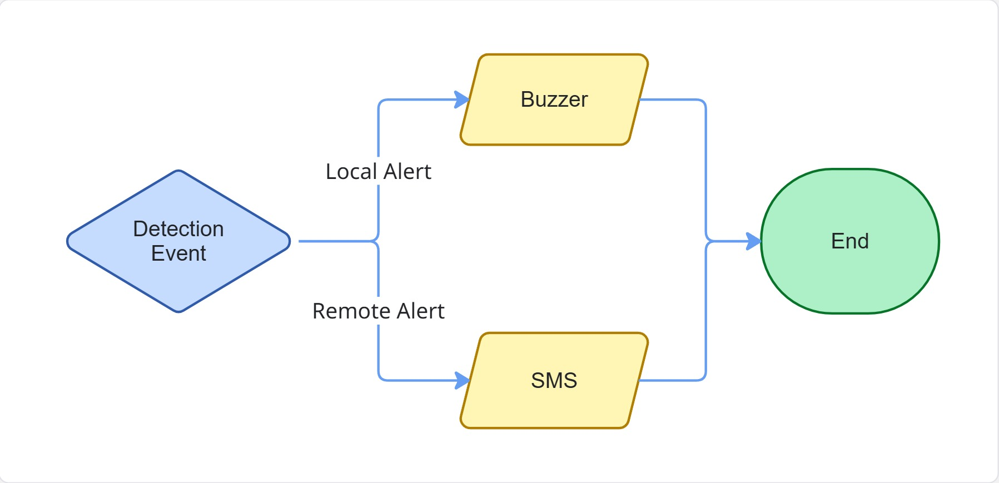
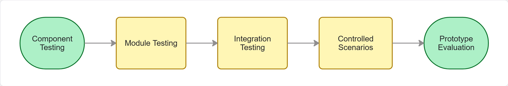

# IoT Microsleep Detection Prototype

**IoT-based technological prototype for identifying microsleep-related indicators in motorcyclists through computer vision, physiological monitoring, embedded systems and real-time alert mechanisms.**

Developed in **2024** as my Technology in Software Development degree project at **Institución Universitaria Colegio Mayor del Cauca**.

> **Project Type:** Academic Prototype · Proof of Concept
> **Role:** Author & Developer
> **Focus:** IoT · Computer Vision · Embedded Systems · Edge Processing · Physiological Monitoring

---

## Overview

Motorcycle riding requires sustained attention and alertness. Microsleep can temporarily reduce a rider's ability to perceive and respond to their environment.

I designed and developed a technological prototype that combines **visual and physiological monitoring** to identify indicators associated with reduced alertness and trigger local or remote alerts.

The system integrates two edge-processing platforms:

- **Raspberry Pi** for camera-based visual monitoring.
- **ESP32 + AD8232** for physiological signal acquisition.

These components are connected through an IoT layer for telemetry and remote visualization.

---

## Problem + Solution

### Problem

Detecting reduced alertness during motorcycle riding requires monitoring indicators that can be observed without relying on a single data source.

### Solution

The prototype combines:

**Computer Vision**

Camera → Face Mesh → Eye Landmarks → EAR → Eye Closure Analysis

**Physiological Monitoring**

AD8232 → ESP32 → ECG Processing → Heart-Rate Information

**IoT & Alerting**

Detection Logic → Local Buzzer / Remote SMS → ThingSpeak Telemetry

The system was conceived as technology that could potentially be integrated into a motorcycle helmet; **helmet design, manufacturing and certification were outside the project scope.**

---

# System Architecture

The prototype uses a distributed architecture where each platform performs a specialized processing role.

### Edge Processing

**Raspberry Pi**

Handles the visual monitoring pipeline:

- Camera acquisition.
- Image processing.
- Face Mesh / facial landmarks.
- Eye landmark extraction.
- Eye Aspect Ratio (EAR) analysis.
- Eye-closure evaluation.

The visual processing pipeline was implemented using Python, OpenCV and MediaPipe.

**ESP32**

Handles physiological monitoring:

- AD8232 ECG acquisition.
- Signal processing.
- Heart-rate information.
- Wi-Fi connectivity.
- Telemetry transmission.

### IoT Layer

The prototype uses:

- Wi-Fi
- HTTP
- ThingSpeak
- Remote telemetry and visualization

### Alert Layer

Detection events can activate:

- **Local:** piezoelectric buzzer.
- **Remote:** external SMS notification service.

---

# Technical Flow

### Computer Vision

The visual pipeline uses **Python, OpenCV and MediaPipe** to process camera input and obtain facial landmarks.

The eye analysis uses **Eye Aspect Ratio (EAR)** as an indicator for evaluating eye closure over time.

### Physiological Monitoring

The physiological subsystem uses an **AD8232 ECG sensor connected to an ESP32** to acquire and process signal information used for heart-rate monitoring.

### IoT Connectivity

Selected telemetry is transmitted through **Wi-Fi and HTTP** to ThingSpeak for remote visualization.

### Alerting

The detection logic connects the monitoring pipeline with local and remote notification mechanisms.

---

# My Engineering Contribution

I worked across the prototype's development lifecycle, from **requirements and architecture design through implementation, integration and validation**.

### System Design

- Defined functional requirements.
- Designed the overall IoT architecture.
- Defined the main hardware and software components.
- Designed the interaction between sensing, processing, communication and alert layers.

### Computer Vision

- Developed the visual monitoring module.
- Implemented the Python processing pipeline.
- Integrated OpenCV and MediaPipe.
- Implemented facial landmark-based eye analysis.
- Implemented EAR-based eye-closure evaluation.

### Embedded Systems

- Developed the ESP32 embedded software.
- Integrated the AD8232 ECG sensor.
- Implemented physiological signal acquisition and processing.
- Implemented heart-rate monitoring.
- Implemented wireless communication.

### IoT

- Implemented Wi-Fi connectivity.
- Implemented HTTP-based communication.
- Integrated ThingSpeak telemetry.
- Designed the data flow between edge devices and the IoT platform.

### Alerting & Integration

- Implemented the local buzzer alert.
- Integrated an external SMS notification service.
- Integrated Raspberry Pi and ESP32 subsystems.
- Connected monitoring, detection, telemetry and alert components.

### Validation

- Designed and executed functional tests
- Tested individual monitoring components.
- Tested IoT communication and telemetry.
- Tested local and remote alert behavior.
- Evaluated the integrated prototype under controlled scenarios.

---

## Technology Stack

| Area | Technologies |
|------|--------------|
| **Languages** | Python · C/C++ |
| **Computer Vision** | OpenCV · MediaPipe · Face Mesh · EAR |
| **Embedded** | ESP32 · Arduino · Raspberry Pi 4 · GPIO |
| **Physiological Sensing** | AD8232 ECG |
| **IoT** | Wi-Fi · HTTP · ThingSpeak |
| **Hardware** | Raspberry Pi Camera · ESP32 · AD8232 · Piezoelectric Buzzer |
| **Notifications** | External SMS Notification Service |

---

## Validation

The prototype was evaluated through **component-level and integrated functional tests**.

Testing focused on:

- Visual monitoring and eye-state analysis.
- Physiological signal acquisition.
- Heart-rate monitoring.
- IoT connectivity and data transmission.
- Local alert activation.
- Remote notification behavior.
- Interaction between the different subsystems.

Validation was performed under **controlled scenarios** to evaluate the behavior of the technological prototype.

The results were not intended to establish clinical validity, production readiness or certification as a motorcycle safety system.

---

# Engineering Learnings

This project provided hands-on experience integrating multiple engineering domains into a single distributed prototype.

### Systems Integration

Designing interfaces between heterogeneous hardware and software components reinforced the importance of clear responsibilities and well-defined data flows.

### Computer Vision

Real-world factors such as lighting, camera positioning and image quality highlighted the challenges involved in building robust visual detection systems.

### Embedded & IoT Systems

The project provided practical experience with resource-constrained devices, sensor acquisition, wireless communication, HTTP telemetry and edge processing.

### Physiological Data

Working with ECG signals demonstrated the additional considerations required when transforming raw sensor data into meaningful system-level information.

---

## Scope and Limitations

This project was developed as an **academic technological prototype and proof of concept**.

### In Scope

- Microsleep-related indicator detection.
- Computer vision.
- Eye-state analysis.
- Physiological monitoring.
- Heart-rate monitoring.
- Embedded systems.
- Edge processing.
- IoT connectivity.
- Cloud telemetry.
- Local alerting.
- Remote notification.

### Out of Scope

- Motorcycle helmet structural design.
- Helmet manufacturing.
- Helmet certification or homologation.
- Regulatory approval as a safety device.
- Commercial production.
- Production deployment.
- Clinical or medical diagnosis.

The prototype was designed with potential integration into a motorcycle helmet in mind, but the project itself did **not** design or manufacture the helmet.

---

## Future Directions

Potential technical directions identified from the prototype include:

- More robust detection under varying environmental conditions.
- Sensor-fusion strategies.
- Adaptive detection thresholds.
- Improved operation under intermittent connectivity.
- Greater edge-processing capabilities.
- More efficient resource utilization.
- Production-oriented hardware integration.
- Broader controlled validation.
- Evaluation of applicable safety and regulatory requirements.

These represent **future development opportunities**, not functionality claimed as part of the original implementation.

---

# Repository Scope

This repository is a **professional portfolio case study**, not a reproduction of the original academic project.

It documents:

- The engineering problem.
- The technical approach.
- The system architecture.
- The technology stack.
- My personal engineering contribution.
- Key implementation concepts.
- Engineering learnings.
- Scope and limitations.

The repository intentionally does **not** contain:

- Original source code
- Original academic diagrams
- Thesis or academic documents
- Institutional deliverables
- Credentials or API keys
- Unpublished academic materials
- Original project assets

Any diagrams included in this repository are conceptual representations created specifically for portfolio documentation.

---

# Intellectual Property

The original project was submitted as a degree project to **Institución Universitaria Colegio Mayor del Cauca**.

The original implementation and academic materials are subject to the intellectual-property arrangements applicable to the submitted work and are therefore not redistributed through this repository.

This repository documents my **technical experience and personal contribution** without reproducing the original institutional deliverables.

---

## Academic Context

**Technology in Software Development — 2024**

**Institución Universitaria Colegio Mayor del Cauca**

**Author & Developer:** Diego Felipe Fernández Meneses

**Academic Director:** Stivens Antonio Dionizio Solarte

**Academic Co-director:** Álvaro Hernán Pito Burbano

---

## Project Status

**Completed · Academic Prototype · 2024**

The original academic development was completed and presented in 2024.

This repository documents the project retrospectively as part of my professional software engineering portfolio.
